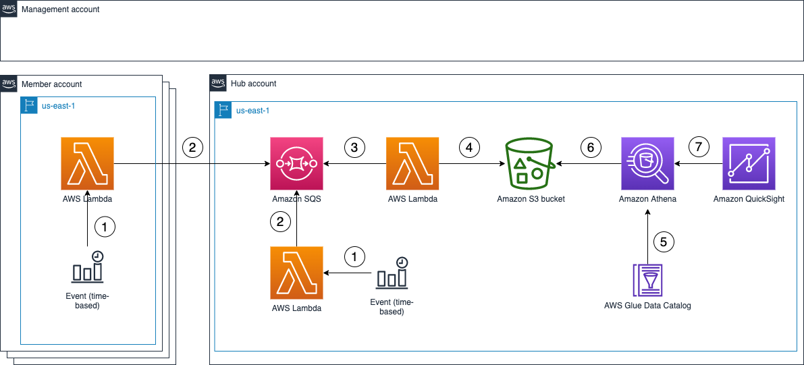

# Visualize AWS IAM Access Analyzer Policy Validation Findings

In this implementation, we show you how to create an [Amazon QuickSight](https://aws.amazon.com/quicksight) dashboard to visualize the policy validation findings from [AWS Identity and Access Management (IAM) Access Analyzer](https://docs.aws.amazon.com/IAM/latest/UserGuide/what-is-access-analyzer.html). You can use this dashboard to better understand your policies and how to achieve [least privilege](https://docs.aws.amazon.com/IAM/latest/UserGuide/best-practices.html#grant-least-privilege) by periodically validating your [IAM](https://aws.amazon.com/iam/) roles against IAM best practices. This blog post walks you through the deployment for a multi-account environment using [AWS Organizations](https://aws.amazon.com/organizations/).

Achieving least privilege is a continuous cycle to grant only the permissions that your users and systems require. To achieve least privilege, you start by setting fine-grained permissions. Then, you verify that the existing access meets your intent. Finally, you refine permissions by removing unused access. To learn more, see [IAM Access Analyzer makes it easier to implement least privilege permissions by generating IAM policies based on access activity](https://aws.amazon.com/blogs/security/iam-access-analyzer-makes-it-easier-to-implement-least-privilege-permissions-by-generating-iam-policies-based-on-access-activity/).

[Policy validation](https://aws.amazon.com/blogs/aws/iam-access-analyzer-update-policy-validation/) is a feature of IAM Access Analyzer that guides you to author and validate secure and functional policies with more than 100 policy checks. You can use these checks when creating new policies or to validate existing policies. To learn how to use IAM Access Analyzer policy validation APIs when creating new policies, see [Validate IAM policies in CloudFormation templates using IAM Access Analyzer](https://aws.amazon.com/blogs/security/validate-iam-policies-in-cloudformation-templates-using-iam-access-analyzer/). In this post, we focus on how to validate existing IAM policies.

For prerequisites and instructions for deploying and using this implementation, see the related AWS security blog post : [How to visualize IAM Access Analyzer policy validation findings with QuickSight](https://aws.amazon.com/blogs/security/how-to-visualize-iam-access-analyzer-policy-validation-findings-with-quicksight/).

## Overview

## Security

See [CONTRIBUTING](CONTRIBUTING.md#security-issue-notifications) for more information.

## License

This library is licensed under the MIT-0 License. See the [LICENSE](LICENSE) file.
